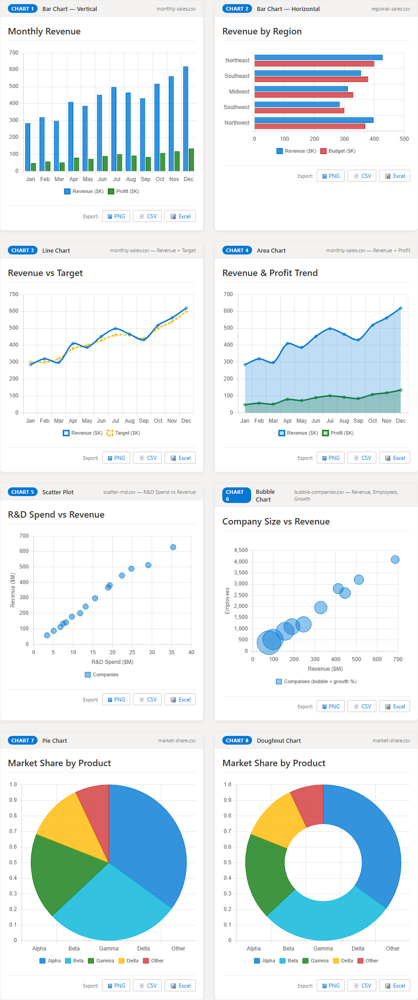
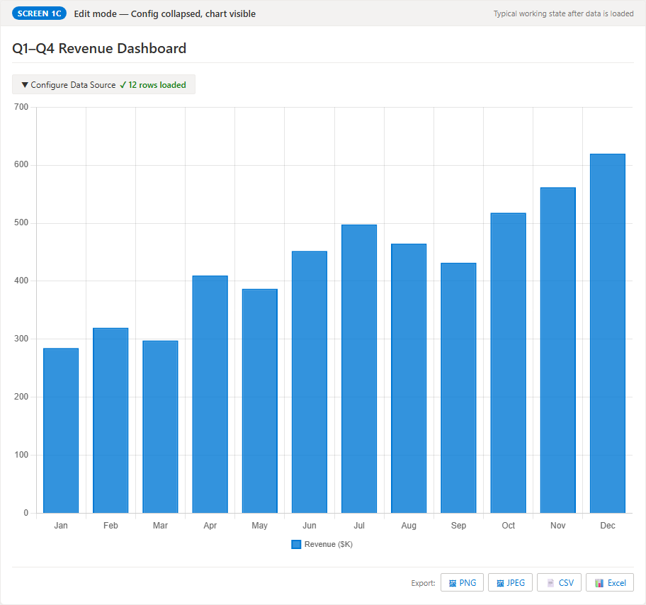
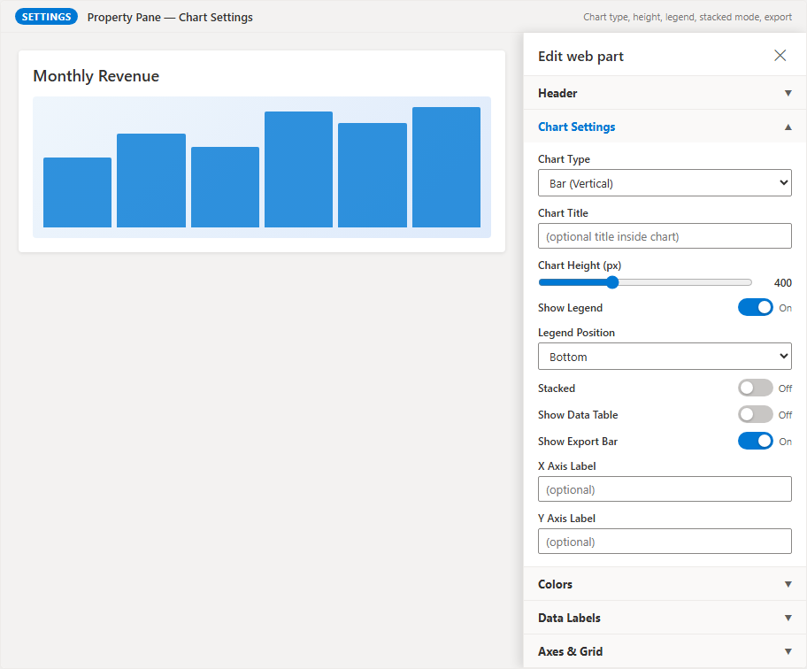
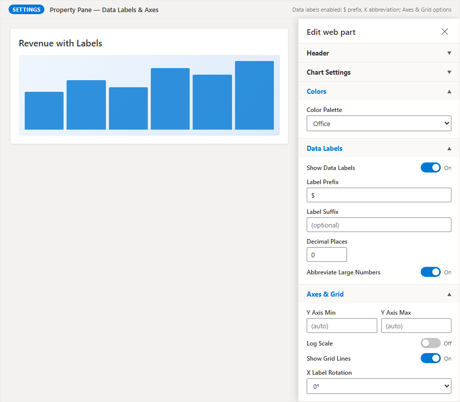

# Smart Data Visualization — SharePoint SPFx Web Part

[](https://sharepointsmartsolutions.com/smart-data-visualization) [](USER-GUIDE.md) [](../../releases/latest) [](LICENSE)

A SharePoint Framework (SPFx) web part that renders interactive charts from multiple data sources with no coding required. Configure everything through the SharePoint page editor.

   

---

## Features

### Data Sources

| Source | Description |
|---|---|
| **Upload File** | Upload a CSV, Excel (.xlsx), or Excel 97–2003 (.xls) file directly from your computer. Data persists across page reloads (up to 200 KB). |
| **SharePoint List** | Load data from any SharePoint list on the current or another site |
| **SharePoint File** | Reference a CSV or Excel file stored in a SharePoint document library by URL |
| **REST API** | Connect to any REST endpoint that returns JSON data |

### Chart Types



| Chart | Best Used For |
|---|---|
| **Bar (Vertical)** | Comparing values across categories |
| **Bar (Horizontal)** | Same as vertical; better for long category names |
| **Line** | Trends over time |
| **Area** | Trends over time with emphasis on volume |
| **Scatter** | Correlation between two numeric variables |
| **Bubble** | Correlation between two numeric variables with a third size dimension |
| **Pie** | Part-to-whole relationships (up to ~7 categories) |
| **Doughnut** | Same as pie with a center hole for labels or KPIs |
| **Radar** | Multi-attribute comparison across several items |

### Other Features

- **Web part header** — optional title above the chart, toggled from the property pane
- **7 color palettes** — Office, Vibrant, Pastel, Monochrome, Traffic Light, Warm, Cool
- **Data labels** — optional value annotations with prefix/suffix and K/M abbreviation
- **Stacked bars** — toggle stacking on Bar and Line charts
- **Data table** — optional tabular view below the chart, paginated
- **Export** — download as PNG, JPEG, CSV, or Excel from every chart

---

## Screenshots

See [Chart Types](#chart-types) above for individual chart screenshots.

| | |
|---|---|
|  |  |
| **Data Source — Empty** | **Data Source — File Loaded** |
|  |  |
| **Hero Chart** | **SharePoint List Source** |
|  |  |
| **Data Labels** | **Color Palettes** |
|  |  |
| **Data Table** | **Stacked Mode** |
|  |  |
| **Property Pane — Chart Settings** | **Property Pane — Data Labels & Axes** |

---

## Installation (No Build Required)

The pre-built package is included in the repository. To deploy without installing Node.js or building anything:

1. Download `sharepoint/solution/smart-data-visualization.sppkg` from this repository.
2. Upload it to your **SharePoint App Catalog** (SharePoint Admin Center → Advanced → App Catalog → Apps for SharePoint).
3. Check **Make this solution available to all sites** and click **Deploy**.
4. On any modern SharePoint page, click **Edit** → **+** → search for **Smart Data Visualization**.

---

## Prerequisites (for Development Only)

| Requirement | Detail |
|---|---|
| **Node.js** | 18.x LTS |
| **npm** | 8+ |
| **Gulp CLI** | `npm install -g gulp-cli` |
| **SharePoint** | Online (Microsoft 365) |

---

## Development Setup

```bash
# Install dependencies (already done if you received this as a built project)
npm install --legacy-peer-deps

# Update serve.json with your SharePoint site URL
# Edit config/serve.json → change initialPage to your workbench URL:
# https://<your-tenant>.sharepoint.com/sites/<your-site>/_layouts/workbench.aspx

# Start local dev server
gulp serve
```

Open the Workbench URL shown in the terminal. Add the **Smart Data Visualization** web part to the page.

---

## Build & Deploy

```bash
# 1. Build a production bundle
gulp bundle --ship

# 2. Package into a .sppkg file
gulp package-solution --ship

# Output: sharepoint/solution/smart-data-visualization.sppkg
```

**Deploy to SharePoint:**
1. Go to **SharePoint Admin Center** → **App Catalog**
2. Upload `smart-data-visualization.sppkg`
3. Check **Make this solution available to all sites** (or deploy to specific sites)
4. On any SharePoint page, click **Edit** → **+** → search for **Smart Data Visualization**

---

## Configuration

All settings are managed through the web part property pane (click the pencil icon while the page is in Edit mode).

**Header**

| Setting | Default | Description |
|---|---|---|
| **Show Header** | Off | Display a prominent title above the chart |
| **Header Text** | _(blank)_ | The title text shown in the header |

**Chart Settings**

| Setting | Default | Description |
|---|---|---|
| **Chart Type** | Bar (Vertical) | Visualization style — 9 options |
| **Chart Title** | _(blank)_ | Title rendered inside the chart canvas |
| **Chart Height** | 400 px | Height of the chart in pixels |
| **Show Legend** | On | Toggle the chart legend on/off |
| **Legend Position** | Bottom | Top, Bottom, Left, or Right |
| **Stacked** | Off | Stack multiple series (Bar and Line charts) |
| **Show Data Table** | Off | Display a paginated data table below the chart |
| **Show Export Bar** | On | Show PNG / JPEG / CSV / Excel export buttons |
| **X Axis Label** | _(blank)_ | Label along the horizontal axis |
| **Y Axis Label** | _(blank)_ | Label along the vertical axis |

**Colors**

| Setting | Default | Description |
|---|---|---|
| **Color Palette** | Office | Choose from 7 palettes: Office, Vibrant, Pastel, Monochrome, Traffic Light, Warm, Cool |

**Data Labels**

| Setting | Default | Description |
|---|---|---|
| **Show Data Labels** | Off | Annotate each data point with its value |
| **Label Prefix** | _(blank)_ | Text prepended to each label (e.g. `$`) |
| **Label Suffix** | _(blank)_ | Text appended to each label (e.g. `%`) |
| **Decimal Places** | 0 | Number of decimal places shown (0–4) |
| **Abbreviate Large Numbers** | Off | Abbreviates 1000 → 1K, 1000000 → 1M |

**Axes & Grid**

| Setting | Default | Description |
|---|---|---|
| **Y Axis Min** | _(auto)_ | Override the minimum value of the Y axis |
| **Y Axis Max** | _(auto)_ | Override the maximum value of the Y axis |
| **Log Scale** | Off | Switch the Y axis to logarithmic scale |
| **Show Grid Lines** | On | Toggle horizontal and vertical grid lines |
| **X Label Rotation** | 0° | Degrees to rotate X axis labels |

---

## Sample Data

The `sample-data/` folder contains ready-to-use files for testing all chart types:

| File | Best Chart Type | Columns |
|---|---|---|
| `monthly-sales.csv` | Bar, Line, Area | Month, Revenue, Units, Target, Profit |
| `regional-sales.csv` | Horizontal Bar | Region, Revenue, Budget, Headcount |
| `market-share.csv` | Pie, Doughnut | Product, MarketShare, Revenue, YoYGrowth |
| `scatter-rnd.csv` | Scatter | Company, RnDSpend, Revenue |
| `bubble-companies.csv` | Bubble | Company, Revenue, Employees, GrowthRate |
| `radar-products.csv` | Radar | Dimension, ProductA, ProductB, ProductC |
| `sales-by-month.csv` | Bar, Line, Area | Month, Online Sales, Store Sales, Total |
| `population-gdp.csv` | Scatter, Bubble | Country, GDP Per Capita, Life Expectancy, Population (M) |
| `product-ratings.csv` | Radar | Product, Performance, Reliability, Ease of Use, Value, Support, Features |
| `api-response-example.json` | Bar, Line | Quarter, Revenue, Expenses, Profit |

To run a local REST API test server:
```bash
node sample-data/test-api-server.js
# API available at http://localhost:3001/data  (Data Path: value)
```

---

## Project Structure

```
smart-data-visualization/
├── config/
│   ├── config.json               # Bundle entry points + localization
│   ├── package-solution.json     # Solution ID, version, metadata
│   └── serve.json                # Local dev server config
├── mockups/                      # Screenshot guide HTML
├── sample-data/                  # Test data files (not deployed)
├── screenshots/                  # Documentation screenshots
├── src/
│   └── webparts/
│       └── smartDataVisualization/
│           ├── SmartDataVisualizationWebPart.ts      # Web part class + property pane
│           ├── SmartDataVisualizationWebPart.manifest.json
│           ├── components/
│           │   ├── SmartDataVisualization.tsx        # Root component
│           │   ├── DataSourcePanel.tsx               # Data loading UI
│           │   ├── ColumnMapper.tsx                  # Column → axis mapping
│           │   ├── ChartRenderer.tsx                 # Chart.js rendering
│           │   ├── DataTable.tsx                     # Tabular data view
│           │   └── SmartDataVisualization.module.scss
│           ├── types/index.ts                        # Shared TypeScript types
│           └── loc/                                  # Localization strings
├── package.json
└── tsconfig.json
```

---

## Key Dependencies

| Package | Purpose |
|---|---|
| `@microsoft/sp-webpart-base` | SPFx 1.20 web part base |
| `chart.js` + `react-chartjs-2` | All chart rendering |
| `papaparse` | CSV parsing |
| `xlsx` 0.18.5 | Excel parsing (Apache 2.0 licensed) |
| `@pnp/sp` | SharePoint list/file access via PnPjs v3 |

---

## Limitations

- **Upload file data size:** Uploaded file data is serialized to the web part property bag. Datasets up to 200 KB persist across page reloads. Larger files display for the current session only — store them in a SharePoint document library and use the SharePoint File source for fully persistent large datasets.
- **Direct database connections:** SPFx cannot connect directly to databases. Use a REST API (e.g., Azure Function or custom API) that queries your database and returns JSON.
- **Cross-origin REST APIs:** The browser's same-origin policy applies. For external APIs, ensure CORS headers are configured on the server.

---

## License

[MIT](LICENSE) © 2026 Sean Regan
