# Smart Data Visualization — User Guide

This guide walks through every feature of the Smart Data Visualization web part from a page editor's perspective.

---

## Table of Contents

1. [Adding the Web Part to a Page](#1-adding-the-web-part-to-a-page)
2. [Simple vs. Advanced Mode](#2-simple-vs-advanced-mode)
3. [Loading Data](#3-loading-data)
   - [Upload File (CSV or Excel)](#upload-file-csv-or-excel)
   - [SharePoint List](#sharepoint-list)
   - [SharePoint File](#sharepoint-file)
   - [REST API](#rest-api)
   - [Microsoft Graph](#microsoft-graph)
4. [Mapping Columns](#4-mapping-columns)
5. [Data Controls — Sort, Filter, Group](#5-data-controls--sort-filter-group)
6. [Advanced Options Panel](#6-advanced-options-panel)
7. [Choosing a Chart Type](#7-choosing-a-chart-type)
8. [Chart Settings (Property Pane)](#8-chart-settings-property-pane)
9. [Analytics — Trendlines, Forecast, Reference Lines](#9-analytics--trendlines-forecast-reference-lines)
10. [Conditional Formatting](#10-conditional-formatting)
11. [Interactive Features for Page Viewers](#11-interactive-features-for-page-viewers)
12. [Web Part Header](#12-web-part-header)
13. [Viewing the Data Table](#13-viewing-the-data-table)
14. [Exporting](#14-exporting)
15. [Sample Data Quick-Start](#15-sample-data-quick-start)
16. [Chart Type Reference](#16-chart-type-reference)
17. [Troubleshooting](#17-troubleshooting)

---

## 1. Adding the Web Part to a Page

1. Navigate to the SharePoint page where you want to display the chart.
2. Click the **Edit** button (pencil icon) in the top-right corner.
3. Click the **+** icon where you want to add the web part.
4. Search for **Smart Data Visualization** and click it.
5. The web part appears in edit mode, showing the data source panel.

> **Tip:** The data source panel and column mapper are only visible when the page is in **Edit** mode. In View mode, page visitors see the chart plus any viewer features you enable (filters, bookmarks, drill-down — see [section 11](#11-interactive-features-for-page-viewers)).

---

## 2. Simple vs. Advanced Mode

The web part starts in **simple mode**, designed for the most common case: one chart, one data source, minimal settings.

| | Simple mode (default) | Advanced mode |
|---|---|---|
| Property pane | One page: Header, Chart Settings, Colors | Three pages: Chart, Appearance, Advanced |
| Chart types | All 15 types always available (grouped) | All 15 types always available (grouped) |
| Inline editor | Data Source, Column Mapping, Data Controls (sort/filter/limit) | Adds group-by aggregation, per-series chart types, and the Advanced Options panel |

To switch: open the property pane and flip **Show Advanced Options** (in the **Advanced** group at the bottom of the first page).

> **Nothing breaks when you switch back.** Turning the toggle off hides the configuration controls, but any advanced behavior you already configured — trendlines, drill-down, viewer filters — keeps working on the published page.

---

## 3. Loading Data

The data source panel shows the source types at the top. Click the one that matches your data and fill in the fields.


---

### Upload File (CSV or Excel)

Use this when you have a data file on your computer.

**Supported formats:** `.csv`, `.tsv`, `.txt`, `.xlsx`, `.xls`

**Steps:**
1. Click the **Upload File** tile in the source selector (selected by default).
2. Click **Choose File…**
3. Select your CSV or Excel file.
4. The file is parsed automatically and you will see a green confirmation (e.g., "Loaded 12 rows with 5 columns").


Once a file is loaded, the **Choose File…** button is replaced by a banner showing the filename and row count, with two actions:

- **Change File…** — opens the file picker again; the current data is replaced when you select a new file.
- **Clear** — removes the loaded data and returns to the empty state.

**Multi-sheet workbooks:** If your Excel file has more than one sheet, an **Excel Sheet** dropdown appears next to the Delimiter field. Switching sheets re-reads the data instantly (no re-upload needed), and your choice is remembered.

**Persistence:** Uploaded data is stored in the web part so it survives page reloads and Edit↔Preview switches, up to 200 KB of data (~500–1000 rows of typical tabular data). If your file exceeds this limit, a yellow warning is shown and the chart displays for the current session only. For large persistent datasets, upload the file to a SharePoint document library and use the **SharePoint File** source instead.

**Sample files to try:**
- `sample-data/monthly-sales.csv` — 12 months of revenue data (bar, line, area charts)
- `sample-data/market-share.csv` — product market share (pie, doughnut charts)

---

### SharePoint List

Use this to connect to a live SharePoint list. The chart automatically reflects the list data every time the page loads.


**Steps:**
1. Click the **SharePoint List** tile in the source selector.
2. **Site URL** (optional): Leave blank to use the current site, or enter a full URL to load from another site (e.g., `https://contoso.sharepoint.com/sites/finance`).
3. **List Name**: Pick a list from the dropdown (lists on the site are discovered automatically), or type the display name if discovery fails.
4. Click **Load Data**.

> **Permissions:** The web part accesses the list using the current user's credentials. Users who do not have permission to read the list will see an error.

> **Large lists:** At most 5,000 items are loaded (a SharePoint platform limit). A warning appears when the cap is hit. Lookup and person columns cannot be charted and are hidden from the column mapper.

---

### SharePoint File

Use this to reference a CSV or Excel file stored in a SharePoint document library. The chart reloads the file each time the page is viewed.

**Steps:**
1. Upload your CSV or Excel file to a SharePoint document library (e.g., Site Contents → Documents).
2. Open the file in the browser, then copy the URL from the address bar.
   Alternatively, right-click the file in the library → **Copy link** → use the direct file URL (ending in `.csv` or `.xlsx`).
3. Click the **SharePoint File** tile in the source selector.
4. Paste the file URL into the **File URL** field.
5. Click **Load Data**.

For multi-sheet Excel files, the **Excel Sheet** dropdown appears after the first load.

**URL format example:**
```
https://contoso.sharepoint.com/sites/mysite/Shared Documents/sales-data.csv
```

> **Tip:** Make sure the file is accessible to everyone who will view the page. The web part fetches the file using the viewer's credentials.

---

### REST API

Use this to load data from any REST API endpoint that returns JSON.

**Steps:**
1. Click the **REST API** tile in the source selector.
2. Enter the **API URL** (e.g., `https://api.example.com/sales`).
3. (Optional) Enter a **Data Path** — the dot-separated path to the data array within the JSON response. OData-style `value` envelopes are unwrapped automatically.
4. Click **Load Data**.

**Data Path examples:**

| JSON Structure | Data Path |
|---|---|
| `[{...}, {...}]` (root array) | *(leave blank)* |
| `{ "value": [{...}] }` (OData / SharePoint REST) | *(leave blank — unwrapped automatically)* |
| `{ "data": { "items": [{...}] } }` | `data.items` |

**SharePoint REST API example:**
```
URL: https://contoso.sharepoint.com/sites/mysite/_api/web/lists/getbytitle('Sales')/items
```

> **Caching:** With Advanced Options on, the **Cache API Results** setting (property pane → Advanced page → Data & Refresh) keeps the response in the browser session for N minutes, so a page with several charts doesn't refetch on every visit. The view-mode **↻ Refresh Data** button always bypasses the cache.

> **CORS:** If you see a CORS error, the API server must include the appropriate `Access-Control-Allow-Origin` headers. The SharePoint REST API already supports this for same-tenant requests.

---

### Microsoft Graph

Use this to chart data from Microsoft Graph — group memberships, usage reports, Planner tasks, and anything else Graph exposes.

**Steps:**
1. Click the **Microsoft Graph** tile in the source selector.
2. Enter the **Graph API Path** — a relative Graph URL, e.g. `/me/memberOf` or `/reports/getTeamsUserActivityUserCounts(period='D7')`.
3. (Optional) Enter a **Data Path** if the array is nested; the standard `value` envelope is unwrapped automatically.
4. Click **Load Data**.

> **Administrator approval required (for this source only):** Graph calls only work after a tenant admin approves the solution's Graph permissions in **SharePoint Admin Center → Advanced → API access**. The package requests `User.Read` as a baseline; endpoints that need more (e.g. `Reports.Read.All`) require those scopes to be added to the package and approved. If you see a 401/403 error, this is almost always the cause.
>
> The permission is **entirely optional** — if you don't use the Microsoft Graph source, the request can stay unapproved and every other data source and feature works normally.

---

## 4. Mapping Columns

After data loads successfully, the **Column Mapping** panel appears below the data source panel.

The fields shown depend on the chart type selected in the property pane.

### For Bar, Line, Area, Radar charts

| Field | What to select |
|---|---|
| **X Axis Column** | The category or time label (e.g., Month, Quarter, Product) |
| **Y Axis Column(s)** | One or more numeric columns to plot (check each one you want) |

With Advanced Options on, each checked Y column also gets a **Default / Bar / Line** dropdown — use it to build combo charts (e.g., revenue bars with a target line).

### For Scatter and Bubble charts

| Field | What to select |
|---|---|
| **X Axis Column** | A **numeric** column for the horizontal axis (only numeric columns are listed) |
| **Y Axis Column** | A **numeric** column for the vertical axis (only numeric columns are listed) |
| **Point Label** | Optional — a text column (e.g., Company, Country) used as the tooltip title and to identify individual points |
| **Size / Radius Column** (Bubble only) | Numeric — determines bubble size (e.g., Employees, Population) |

> Scatter and bubble require numbers on both axes — the X and Y dropdowns only show numeric columns. Use **Point Label** to associate a text identifier (like a company name) with each point; it appears as the tooltip title when you hover a point.

### For Pie / Doughnut charts

| Field | What to select |
|---|---|
| **Label Column** | Text column for slice labels (e.g., Company, Product) |
| **Value Column** | Numeric column for slice sizes (e.g., Market Share) |

### For the advanced chart types

| Chart | Mapping fields |
|---|---|
| **KPI Tile** | Value Column only — the number to aggregate |
| **Histogram** | Column to Bin (numeric) only |
| **Waterfall** | Category Column + Value Column |
| **Box Plot** | Category Column + Value Column |
| **Treemap** | Group / Label Column + Value Column (tile size) |
| **Heatmap** | Column (X) Category + Row (Y) Category + Value Column |

> **Tip:** Column choices are saved automatically. The chart updates immediately as you change selections.

---

## 5. Data Controls — Sort, Filter, Group

The **Data Controls** panel (below Column Mapping) shapes the data before it reaches the chart:

| Control | Description |
|---|---|
| **Sort by Column / Direction** | Order the rows ascending or descending by any column |
| **Row Limit** | Chart only the first N rows after sorting (0 = all) — great for "Top 10" charts |
| **Filter Column / contains** | Keep only rows where a column contains the typed text |
| **Group by Column** † | Collapse rows into one per category |
| **Aggregation** † | How grouped numeric values combine: Sum, Average, Count, Min, Max |

† Visible with Advanced Options on.

**Aggregation example:** a SharePoint task list with one row per task can be charted as *task count per assignee* by grouping by `AssignedTo` with aggregation `Count`, then mapping X = `AssignedTo`, Y = `Count`. Sum/Average/Min/Max apply to every numeric column per group; Count produces a single `Count` column.

The pipeline order is: filter → group/aggregate → sort → row limit.

---

## 6. Advanced Options Panel

With Advanced Options on, a collapsed **▼ Advanced Options** button appears below Data Controls.

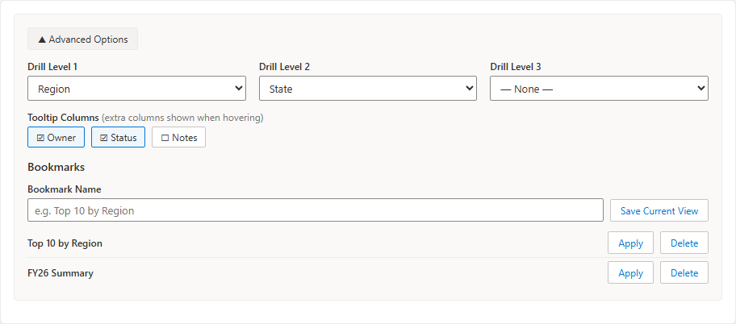

It contains:

### Color by Column (Scatter / Bubble)

Color points by a category column instead of by series — e.g., a scatter of GDP vs. life expectancy with each continent in its own color. Each category gets a palette color and a legend entry.

### Tooltip Columns

Check any columns to append them to the hover tooltip. Useful for context that isn't charted — hovering a bar can show the owner, status, or notes from the same row.

### Drill-Down Hierarchy

Define up to three levels (e.g., Level 1 `Region`, Level 2 `Country`, Level 3 `City`):

- Clicking a chart element drills into that category — the chart re-aggregates at the next level.
- A breadcrumb (**All › West › California**) appears above the chart; click any crumb to drill back up.
- Works for page viewers too, not just editors.
- Values are aggregated at each level using your Aggregation setting (defaults to Sum).

### Bookmarks

Save the current view — filters, sorting, grouping, and column mapping — under a name:

1. Type a name (e.g., `Top 10 by Region`) and click **Save Current View**.
2. Apply or delete saved bookmarks from the list.
3. Page viewers get a **— Apply a bookmark —** dropdown above the chart (see [section 11](#11-interactive-features-for-page-viewers)).

Applying a bookmark changes the view without altering the saved page configuration.

---

## 7. Choosing a Chart Type

Open the **property pane** by clicking the pencil/settings icon on the web part while in Edit mode, then pick from the **Chart Type** dropdown. All 15 chart types are always visible, organized into two groups.

**Standard Charts:**

| Option | When to use |
|---|---|
| Bar Chart (Vertical) | Comparing values across named categories |
| Bar Chart (Horizontal) | Same as vertical; better for long category names |
| Line Chart | Showing trends over time |
| Area Chart | Trends with volume emphasis |
| Pie Chart | Part-to-whole (best with 3–7 slices) |
| Doughnut Chart | Same as Pie with center space |
| Scatter Plot | Finding correlations between two numeric variables |
| Bubble Chart | Scatter + a third variable represented by bubble size |
| Radar Chart | Comparing multiple attributes across several subjects |

**Specialized Charts:**

| Option | When to use |
|---|---|
| KPI Tile | One headline number (e.g., total revenue) with threshold coloring |
| Histogram | Distribution of a numeric column (configurable bins) |
| Waterfall Chart | Cumulative gains/losses — monthly P&L, budget bridges |
| Box Plot | Spread and outliers of values within each category |
| Treemap | Proportions as area tiles — good for many categories |
| Heatmap | Intensity across two category dimensions (e.g., weekday × hour) |

---

## 8. Chart Settings (Property Pane)

In simple mode all settings are on one page. With Advanced Options on, they're organized into three pages — use the **Back / Next** links at the bottom of the pane.

### Page 1 — Chart

| Setting | Description |
|---|---|
| **Show Header / Header Text** | Page-level title above the chart (see [section 12](#12-web-part-header)) |
| **Chart Title** | Text displayed inside the chart canvas |
| **Chart Type** | The visualization style (see [section 7](#7-choosing-a-chart-type)) |
| **Legend Position** | Bottom, Top, Left, or Right |
| **Chart Height** | Height in pixels (default 400) |
| **Show Legend** | Toggle the chart legend |
| **Stacked** | For Bar and Line charts: stack multiple series |
| **Show Data Table** | Paginated table below the chart |
| **Show Export Bar** | PNG / JPEG / CSV / Excel buttons below the chart |
| **X / Y Axis Label** | Axis captions |
| **Histogram Bins** | Number of bins (Histogram only) |
| **Show Advanced Options** | The master switch for everything advanced |

### Page 2 — Appearance (advanced)

| Setting | Description |
|---|---|
| **Color Palette** | 7 palettes: Office, Vibrant, Pastel, Monochrome, Traffic Light, Warm, Cool |
| **Show Data Labels** | Display each data point's value on the chart |
| **Value Prefix / Suffix** | Text around each label (e.g., `$`, `%`) |
| **Decimal Places** | 0–4 |
| **Abbreviate Numbers (K/M)** | 1,000 → 1K, 1,000,000 → 1M |
| **Y Axis Minimum / Maximum** | Override the axis range (leave blank for automatic) |
| **Logarithmic Scale** | For values spanning several orders of magnitude |
| **Show Grid Lines** | Toggle grid lines |
| **X Label Rotation** | Rotate long category labels |
| **X Axis Type** | **Auto-detect** (default), **Category**, or **Time (dates)** — Time plots date values on a true chronological axis |

### Page 3 — Advanced (advanced)

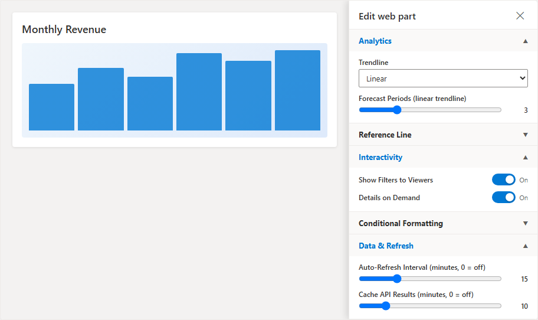

Covered in detail in sections [9](#9-analytics--trendlines-forecast-reference-lines), [10](#10-conditional-formatting), and [11](#11-interactive-features-for-page-viewers), plus:

| Setting | Description |
|---|---|
| **Auto-Refresh Interval** | Reload network sources every N minutes (0 = off) — for always-on dashboard pages |
| **Cache API Results** | Cache REST/Graph responses for N minutes per browser session (0 = off) |

All settings are saved with the page automatically.

---

## 9. Analytics — Trendlines, Forecast, Reference Lines

*(Property pane → Advanced page → Analytics and Reference Line groups)*

### Trendlines

| Option | Description |
|---|---|
| **Linear** | A least-squares regression line per Y series, drawn dashed |
| **Moving Average** | A smoothed dashed line; set the **Moving Average Window** (2–20 points) |

### Forecast

With a **Linear** trendline active, set **Forecast Periods** (1–12) to project the trend past your data. Forecast positions appear as `+1`, `+2`, … on the X axis. (Category axis only.)

### Reference Lines

Draw a dashed horizontal line at:

- a **Fixed value** you type (e.g., a target of `100000`),
- the **Mean** of the first Y series, or
- the **Median** of the first Y series.

The line is labeled with its value in the legend, and its color is configurable.

---

## 10. Conditional Formatting

*(Property pane → Advanced page → Conditional Formatting)*

Highlight values that cross a threshold:

1. Enter a **Threshold Value** (e.g., `50000`).
2. Choose whether to highlight values **Below threshold** or **Above threshold**.
3. Pick the **Highlight Color** (hex, default red `#d13438`).

Bars crossing the threshold are recolored; on line/area charts the data points are recolored. The KPI Tile also uses the threshold — the headline number turns the highlight color when it breaches.

---

## 11. Interactive Features for Page Viewers

These features change what *visitors* can do with the published page. All are off by default.

### Viewer Filter Bar

*(Property pane → Advanced page → Interactivity → "Show Filters to Viewers")*

Viewers get a compact filter row above the chart: pick a column, type text, and the chart filters live. Viewer filters are per-visit only — they never change the saved page.

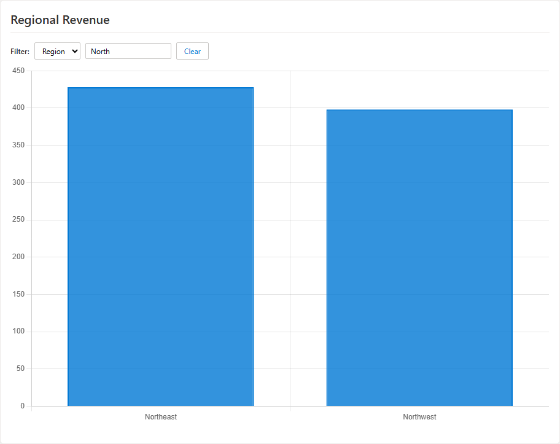

### Details on Demand

*("Details on Demand" toggle)*

Clicking a bar, point, or slice shows the underlying data rows in a table below the chart, with a chip like **Details: Apr (3 rows)** and a Clear button. Ideal when the chart is aggregated and viewers want to see what's behind a number.

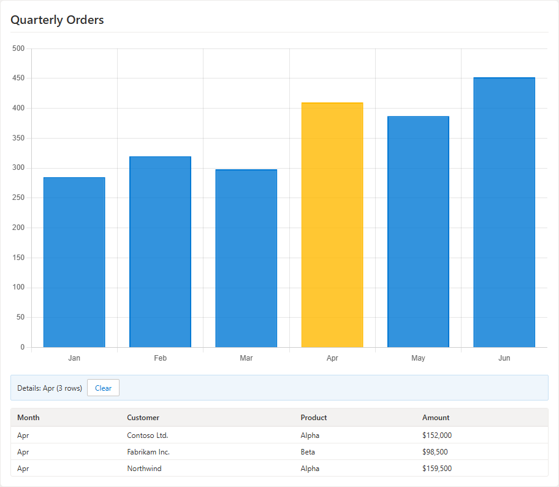

### Drill-Down

If you configured a [drill-down hierarchy](#drill-down-hierarchy), viewers can click to drill and use the breadcrumb to navigate — no edit rights needed.

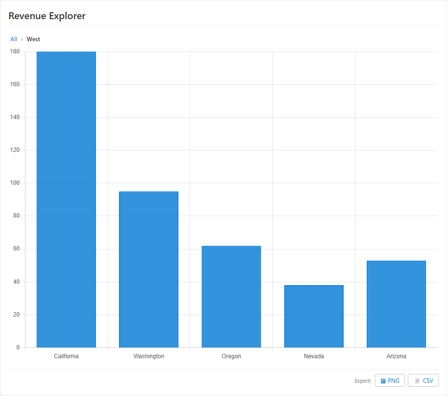

### Bookmarks

If you saved [bookmarks](#bookmarks), viewers get a **— Apply a bookmark —** dropdown to switch between your prepared views.

### Refresh

For list/file/API sources, viewers see a **↻ Refresh Data** button to re-pull the data on demand. Combine with **Auto-Refresh Interval** for wall-mounted dashboards.

### Connecting Other Web Parts (Dynamic Data)

The web part publishes three dynamic data properties — **Selected category**, **Selected value**, and **Selected series** — updated whenever someone clicks a chart element. Web parts that consume dynamic data (e.g., the Embed web part, or list web parts with dynamic filtering) can connect to these to build click-to-filter dashboards: edit the consuming web part → **Connect to source** → choose the Smart Data Visualization web part.

---

## 12. Web Part Header

The web part can display an optional title above the chart, styled like a standard SharePoint web part header.

To enable it:
1. Open the **property pane** (pencil icon on the web part).
2. In the **Header** group at the top of the pane, toggle **Show Header** on.
3. Type the header text in the **Header Text** field.

The header appears as a prominent title line above the chart in both Edit and View modes.

> **Note:** This is separate from the property pane's **Chart Title** field, which places a smaller title inside the chart canvas itself. Use the web part header for the page-level title and the chart title for axis-level annotation.

---

## 13. Viewing the Data Table

Enable **Show Data Table** in the property pane to display a scrollable, paginated table of all loaded data below the chart.


- Rows are shown 20 at a time with **Prev / Next** navigation.
- The table is visible in both Edit and View mode.
- The table reflects your sort, filter, and aggregation settings.

---

## 14. Exporting

When **Show Export Bar** is on, four buttons appear below the chart:

| Button | Output |
|---|---|
| **PNG** / **JPEG** | The chart as an image — for slide decks and emails |
| **CSV** | The processed data (after filters/aggregation) as UTF-8 CSV — opens cleanly in Excel, including arrows and accented characters |
| **Excel** | The same data as an `.xlsx` workbook |

Cell values that could be interpreted as formulas are escaped automatically, so exported files are safe to open.

---

## 15. Sample Data Quick-Start

The following examples let you try the chart types immediately using the included sample files.

### Bar Chart — Monthly Revenue

1. Data source: **Upload File** → select `sample-data/monthly-sales.csv`
2. Chart type (property pane): **Bar Chart (Vertical)**
3. X Axis: `Month`  |  Y Axis: check `Revenue` and `Target`
4. Header text: `Monthly Revenue vs Target`


### Horizontal Bar Chart — Revenue by Region

1. Data source: **Upload File** → select `sample-data/regional-sales.csv`
2. Chart type: **Bar Chart (Horizontal)**
3. X Axis: `Region`  |  Y Axis: check `Revenue`


### Line Chart — Revenue vs Target

1. Data source: **Upload File** → select `sample-data/monthly-sales.csv`
2. Chart type: **Line Chart**
3. X Axis: `Month`  |  Y Axis: check `Revenue` and `Target`


### Area Chart — Revenue & Profit Trend

1. Data source: **Upload File** → select `sample-data/monthly-sales.csv`
2. Chart type: **Area Chart**
3. X Axis: `Month`  |  Y Axis: check `Revenue` and `Profit`


### Scatter Plot — R&D Spend vs Revenue

1. Data source: **Upload File** → select `sample-data/scatter-rnd.csv`
2. Chart type: **Scatter Plot**
3. X Axis: `RnDSpend`  |  Y Axis: `Revenue`


### Bubble Chart — Company Size vs Revenue

1. Data source: **Upload File** → select `sample-data/bubble-companies.csv`
2. Chart type: **Bubble Chart**
3. X Axis: `Revenue`  |  Y Axis: `Employees`  |  Point Label: `Company`  |  Size: `GrowthRate`


### Pie Chart — Market Share

1. Data source: **Upload File** → select `sample-data/market-share.csv`
2. Chart type: **Pie Chart**
3. Label Column: `Product`  |  Value Column: `MarketShare`


### Doughnut Chart — Market Share

1. Data source: **Upload File** → select `sample-data/market-share.csv`
2. Chart type: **Doughnut Chart**
3. Label Column: `Product`  |  Value Column: `MarketShare`


### Radar Chart — Product Comparison

1. Data source: **Upload File** → select `sample-data/radar-products.csv`
2. Chart type: **Radar Chart**
3. X Axis: `Dimension`  |  Y Axis: check `ProductA`, `ProductB`, `ProductC`


### Specialized chart types

| Chart | Sample file | Mapping |
|---|---|---|
| **KPI Tile** | `monthly-sales.csv` | Value: `Revenue` — shows total revenue; add a Threshold to color it |
| **Histogram** | `study-hours-scores.csv` | Column to Bin: `Test Score` |
| **Waterfall** | `monthly-sales.csv` | Category: `Month`, Value: `Profit` |
| **Box Plot** | `study-hours-scores.csv` | Category: `Study Hours`, Value: `Test Score` |
| **Treemap** | `market-share.csv` | Group: `Product`, Value: `MarketShare` |

No sample file ships with two category dimensions for the **Heatmap** — try it with your own data (e.g., weekday × hour, region × product) where each row has two categories and a numeric value.

| | |
|---|---|
| 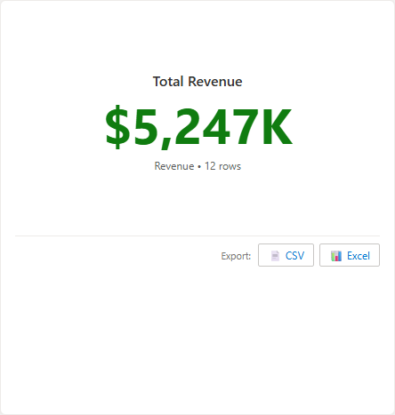 | 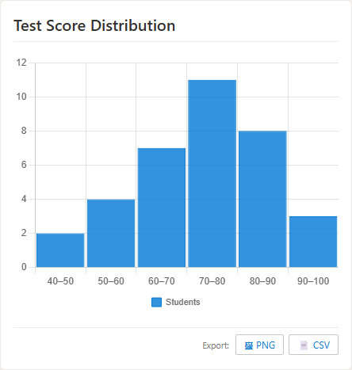 |
| **KPI Tile** | **Histogram** |
| 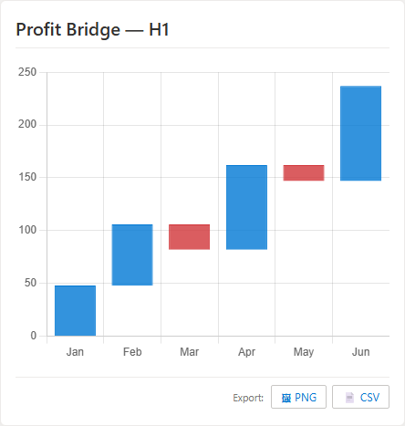 | 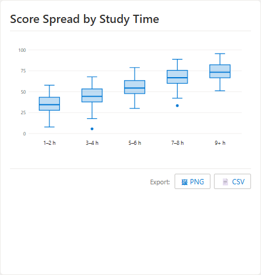 |
| **Waterfall** | **Box Plot** |
| 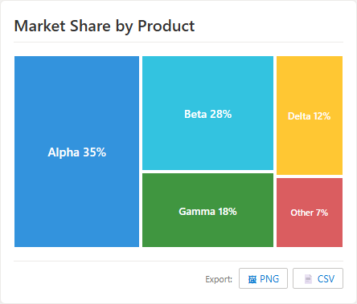 | 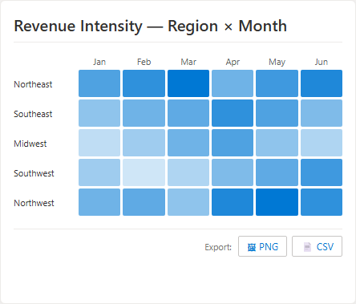 |
| **Treemap** | **Heatmap** |

---

## 16. Chart Type Reference

### Stacked mode

Turn on **Stacked** in the property pane when you want to show how individual parts contribute to a total. For example, Revenue + Profit stacked shows both the breakdown and the combined total at the same time.


### Data Labels

Enable **Show Data Labels** to annotate each bar, point, or slice with its value. Use **Value Prefix** (e.g., `$`) and **Abbreviate Numbers** to format values as `$285K` instead of `285000`.


### Color Palettes

Seven built-in palettes are available in the property pane. Choose one that fits your SharePoint theme or use case. Individual series colors can be overridden with the color swatch next to each checked Y column.


### Multi-series and combo charts

Bar, Line, Area, and Radar charts support multiple Y columns — each becomes a series with its own color. With Advanced Options on, Bar/Line/Area series can individually render as bars or lines for combo charts.

### Pie / Doughnut best practices

- Keep to 7 or fewer slices for readability.
- Use the **Legend** to identify slices when labels don't fit.
- For many categories, use a Bar chart or **Treemap** instead.

### Bubble chart sizing

The **Size / Radius column** values are square-rooted internally to keep proportions readable. A company with 1000 employees produces a bubble proportional to √1000 ≈ 31.6, not 1000 pixels wide.

### KPI Tile aggregation

The KPI Tile aggregates its Value column using the **Aggregation** setting from Data Controls (default: Sum). Set Aggregation to `Average` for a mean KPI, `Count` for a row count, and so on. The row count is always shown beneath the number.

### Heatmap color intensity

Cell color intensity scales with the absolute value relative to the largest value in the data — the strongest cell is fully saturated, near-zero cells are nearly transparent.

---

## 17. Troubleshooting

### "No data loaded yet"

The chart area shows this message when no data has been loaded. Select a source type, upload or configure your data, and confirm you see a green success message.

### "Failed to parse file" on upload

- Ensure the file is a valid `.csv`, `.tsv`, `.txt`, `.xlsx`, or `.xls` file.
- For CSV files, confirm the first row is a header row with column names.
- For multi-sheet Excel files, pick the right sheet from the **Excel Sheet** dropdown.

### Uploaded data is gone after page refresh

If the file exceeded the 200 KB persistence limit, a yellow warning was shown on upload. The data displays for the current session only. Either upload a smaller/filtered file, or store the file in a SharePoint document library and use the **SharePoint File** source.

### SharePoint list error: "Failed to load SharePoint list"

- Double-check the list name (it must match the display name exactly).
- Ensure you have at least Read permission on the list.
- If loading from another site, verify the Site URL is correct and accessible.

### "This list has 5,000 or more items; only the first 5,000 were loaded"

A SharePoint platform limit. Pre-filter or aggregate the data upstream (e.g., a filtered list, a Power Automate rollup, or a REST endpoint) if you need more than 5,000 rows charted.

### Microsoft Graph: "HTTP 401" or "HTTP 403"

The solution's Graph permissions have not been approved, or your endpoint requires a scope that wasn't requested. Ask a tenant admin to approve the request in **SharePoint Admin Center → Advanced → API access**, and add any extra scopes to `config/package-solution.json`.

### REST API: "HTTP 401" or "HTTP 403"

The API requires authentication. SPFx passes the user's SharePoint credentials automatically for same-tenant URLs, but external APIs may require API keys or OAuth tokens not supported by this web part.

### REST API: CORS error

The API server must include `Access-Control-Allow-Origin: *` (or your SharePoint domain) in its response headers.

### "Scatter and bubble charts need numeric values…"

The X or Y axis is mapped to a column that contains no numbers (e.g., a `Company` name column). The X and Y dropdowns only list numeric columns — pick one of those. If you want to label each point with a text value like a company name, use the **Point Label** field in the Column Mapping panel instead of the axis fields. Rows with occasional non-numeric values in the axis columns are simply skipped.

### Chart appears but shows gaps or missing bars

Blank or non-numeric cells render as gaps rather than zeros — this is intentional so missing data doesn't distort trends. If you expected values, check the source data.

### Data is loaded but the chart says "select column mappings"

Scroll down to the **Column Mapping** panel and select the required columns for the current chart type (see [section 4](#4-mapping-columns)).

### I can't find a setting that used to be there

Turn on **Show Advanced Options** (property pane, bottom of the first page). Simple mode hides advanced settings, but anything you previously configured continues to work.

### Drill-down clicks don't do anything

Define at least one drill level in **Advanced Options → Drill Level 1** while editing. Note that Histogram, Box Plot, Treemap, and Heatmap charts don't support click-to-drill.
