# Smart Data Visualization — User Guide

This guide walks through every feature of the Smart Data Visualization web part from a page editor's perspective.

---

## Table of Contents

1. [Adding the Web Part to a Page](#1-adding-the-web-part-to-a-page)
2. [Loading Data](#2-loading-data)
   - [Upload File (CSV or Excel)](#upload-file-csv-or-excel)
   - [SharePoint List](#sharepoint-list)
   - [SharePoint File](#sharepoint-file)
   - [REST API](#rest-api)
3. [Mapping Columns](#3-mapping-columns)
4. [Choosing a Chart Type](#4-choosing-a-chart-type)
5. [Chart Settings (Property Pane)](#5-chart-settings-property-pane)
6. [Web Part Header](#6-web-part-header)
7. [Viewing the Data Table](#7-viewing-the-data-table)
8. [Sample Data Quick-Start](#8-sample-data-quick-start)
9. [Chart Type Reference](#9-chart-type-reference)
10. [Troubleshooting](#10-troubleshooting)

---

## 1. Adding the Web Part to a Page

1. Navigate to the SharePoint page where you want to display the chart.
2. Click the **Edit** button (pencil icon) in the top-right corner.
3. Click the **+** icon where you want to add the web part.
4. Search for **Smart Data Visualization** and click it.
5. The web part appears in edit mode, showing the data source panel.

> **Tip:** The data source panel and column mapper are only visible when the page is in **Edit** mode. In View mode, only the chart (and optional data table) is shown to page visitors.

---

## 2. Loading Data

The data source panel shows four source types at the top. Click the one that matches your data and fill in the fields.

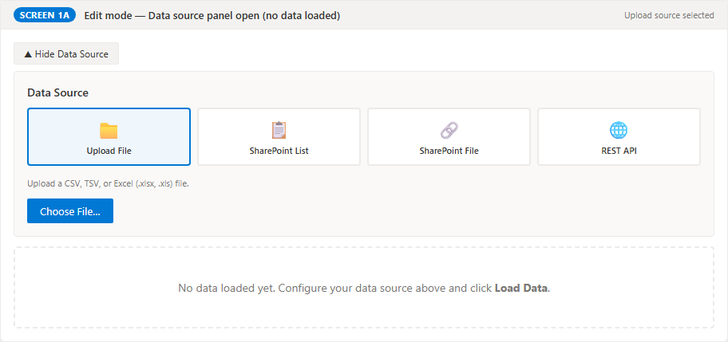

---

### Upload File (CSV or Excel)

Use this when you have a data file on your computer.

**Supported formats:** `.csv`, `.tsv`, `.xlsx`, `.xls`

**Steps:**
1. Click the **Upload File** tile in the source selector (selected by default).
2. Click **Choose File…**
3. Select your CSV or Excel file.
4. The file is parsed automatically and you will see a green confirmation (e.g., "Loaded 12 rows with 5 columns").

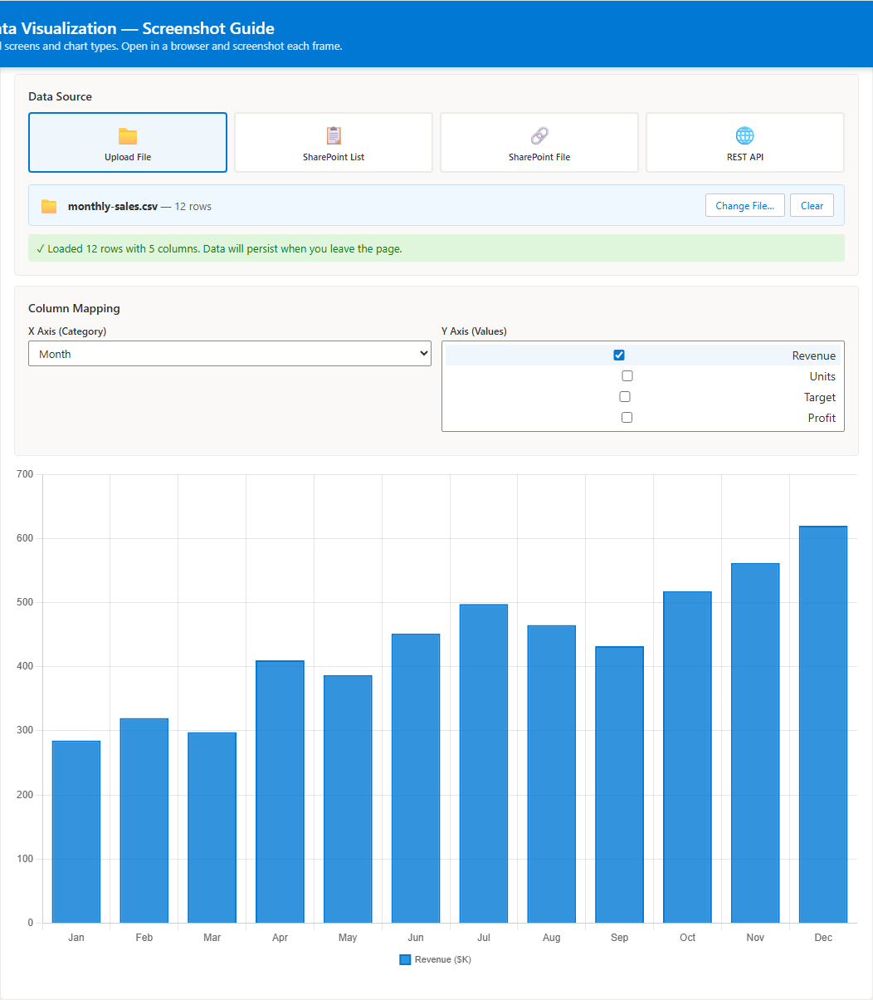

Once a file is loaded, the **Choose File…** button is replaced by a banner showing the filename and row count, with two actions:

- **Change File…** — opens the file picker again; the current data is replaced when you select a new file.
- **Clear** — removes the loaded data and returns to the empty state.

**Persistence:** Uploaded data is stored in the web part so it survives page reloads and Edit↔Preview switches, up to 200 KB of data (~500–1000 rows of typical tabular data). If your file exceeds this limit, a yellow warning is shown and the chart displays for the current session only. For large persistent datasets, upload the file to a SharePoint document library and use the **SharePoint File** source instead.

**Sample files to try:**
- `sample-data/monthly-sales.csv` — 12 months of revenue data (bar, line, area charts)
- `sample-data/market-share.csv` — product market share (pie, doughnut charts)

---

### SharePoint List

Use this to connect to a live SharePoint list. The chart automatically reflects the list data every time the page loads.

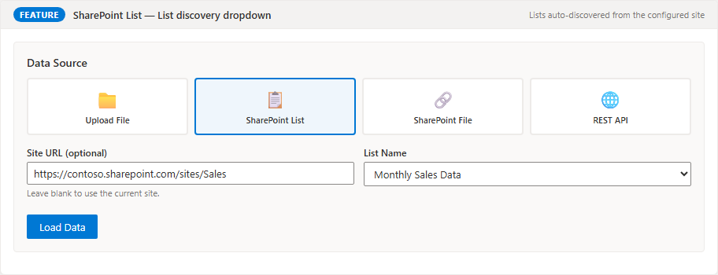

**Steps:**
1. Click the **SharePoint List** tile in the source selector.
2. **Site URL** (optional): Leave blank to use the current site, or enter a full URL to load from another site (e.g., `https://contoso.sharepoint.com/sites/finance`).
3. **List Name**: Enter the exact display name of the list (e.g., `Sales Data`, `Project Tracker`).
4. Click **Load Data**.

> **Permissions:** The web part accesses the list using the current user's credentials. Users who do not have permission to read the list will see an error.

---

### SharePoint File

Use this to reference a CSV or Excel file stored in a SharePoint document library. The chart reloads the file each time the page is viewed.

**Steps:**
1. Upload your CSV or Excel file to a SharePoint document library (e.g., Site Contents → Documents).
2. Open the file in the browser, then copy the URL from the address bar.
   Alternatively, right-click the file in the library → **Copy link** → use the direct file URL (ending in `.csv` or `.xlsx`).
3. Click the **SharePoint File** tile in the source selector.
4. Paste the file URL into the **File URL** field.
5. Click **Load Data**.

**URL format example:**
```
https://contoso.sharepoint.com/sites/mysite/Shared Documents/sales-data.csv
```

> **Tip:** Make sure the file is accessible to everyone who will view the page. The web part fetches the file using the viewer's credentials.

---

### REST API

Use this to load data from any REST API endpoint that returns JSON.

**Steps:**
1. Click the **REST API** tile in the source selector.
2. Enter the **API URL** (e.g., `https://api.example.com/sales`).
3. (Optional) Enter a **Data Path** — the dot-separated path to the data array within the JSON response.
4. Click **Load Data**.

**Data Path examples:**

| JSON Structure | Data Path |
|---|---|
| `[{...}, {...}]` (root array) | *(leave blank)* |
| `{ "value": [{...}] }` (OData / SharePoint REST) | `value` |
| `{ "data": { "items": [{...}] } }` | `data.items` |

**SharePoint REST API example:**
```
URL: https://contoso.sharepoint.com/sites/mysite/_api/web/lists/getbytitle('Sales')/items
Data Path: value
```

> **CORS:** If you see a CORS error, the API server must include the appropriate `Access-Control-Allow-Origin` headers. The SharePoint REST API already supports this for same-tenant requests.

---

## 3. Mapping Columns

After data loads successfully, the **Column Mapping** panel appears below the data source panel.

The fields shown depend on the chart type selected in the property pane.

### For Bar, Line, Area, Radar charts

| Field | What to select |
|---|---|
| **X Axis Column** | The category or time label (e.g., Month, Quarter, Product) |
| **Y Axis Column(s)** | One or more numeric columns to plot (check each one you want) |

### For Scatter charts

| Field | What to select |
|---|---|
| **X Axis Column** | A numeric column for the horizontal axis |
| **Y Axis Column** | A numeric column for the vertical axis |

### For Bubble charts

| Field | What to select |
|---|---|
| **X Axis Column** | Numeric — horizontal position |
| **Y Axis Column** | Numeric — vertical position |
| **Size / Radius Column** | Numeric — determines bubble size (e.g., Employees, Population) |

### For Pie / Doughnut charts

| Field | What to select |
|---|---|
| **Label Column** | Text column for slice labels (e.g., Company, Product) |
| **Value Column** | Numeric column for slice sizes (e.g., Market Share) |

> **Tip:** Column choices are saved automatically. The chart updates immediately as you change selections.

---

## 4. Choosing a Chart Type

Open the **property pane** by clicking the pencil/settings icon on the web part while in Edit mode.

Select from the **Chart Type** dropdown:

| Option | When to use |
|---|---|
| Bar Chart (Vertical) | Comparing values across named categories |
| Bar Chart (Horizontal) | Same as vertical; better for long category names |
| Line Chart | Showing trends over time |
| Area Chart | Trends with volume emphasis |
| Scatter Plot | Finding correlations between two numeric variables |
| Pie Chart | Part-to-whole (best with 3–7 slices) |
| Doughnut Chart | Same as Pie with center space |
| Bubble Chart | Scatter + a third variable represented by bubble size |
| Radar Chart | Comparing multiple attributes across several subjects |

---

## 5. Chart Settings (Property Pane)

Click the pencil/edit icon on the web part to open the property pane (right-side panel).

| Setting | Description |
|---|---|
| **Chart Title** | Text displayed inside the chart area. Leave blank for no chart title. |
| **Chart Type** | The visualization style (see above). |
| **Show Legend** | Toggle the chart legend on/off. |
| **Stacked** | For Bar and Line charts: stacks multiple series on top of each other instead of side by side. |
| **Show Data Labels** | Displays the value of each data point on the chart. |
| **Label Prefix / Suffix** | Text added before/after each data label (e.g., `$` prefix, `%` suffix). |
| **Abbreviate Large Numbers** | Abbreviates 1,000 → 1K, 1,000,000 → 1M in data labels. |
| **Color Palette** | Choose from 7 palettes: Office, Vibrant, Pastel, Monochrome, Traffic Light, Warm, Cool. |
| **Show Data Table** | Displays the raw data in a paginated table below the chart. |
| **X Axis Label** | Label shown along the horizontal axis. |
| **Y Axis Label** | Label shown along the vertical axis. |

All settings are saved with the page automatically.

---

## 6. Web Part Header

The web part can display an optional title above the chart, styled like a standard SharePoint web part header.

To enable it:
1. Open the **property pane** (pencil icon on the web part).
2. In the **Header** group at the top of the pane, toggle **Show Header** on.
3. Type the header text in the **Header Text** field.

The header appears as a prominent title line above the chart in both Edit and View modes.

> **Note:** This is separate from the property pane's **Chart Title** field, which places a smaller title inside the chart canvas itself. Use the web part header for the page-level title and the chart title for axis-level annotation.

---

## 7. Viewing the Data Table

Enable **Show Data Table** in the property pane to display a scrollable, paginated table of all loaded data below the chart.

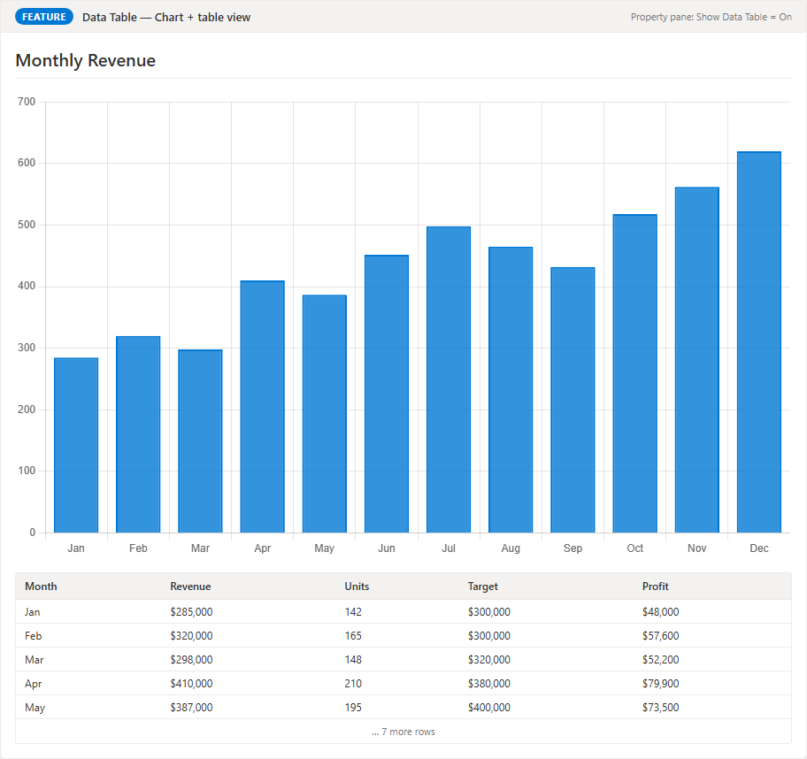

- Rows are shown 20 at a time with **Prev / Next** navigation.
- The table is visible in both Edit and View mode.

---

## 8. Sample Data Quick-Start

The following examples let you try every chart type immediately using the included sample files.

### Bar Chart — Monthly Revenue

1. Data source: **Upload File** → select `sample-data/monthly-sales.csv`
2. Chart type (property pane): **Bar Chart (Vertical)**
3. X Axis: `Month`  |  Y Axis: check `Revenue` and `Target`
4. Header text: `Monthly Revenue vs Target`

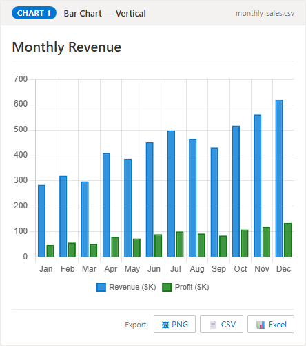

### Horizontal Bar Chart — Revenue by Region

1. Data source: **Upload File** → select `sample-data/regional-sales.csv`
2. Chart type: **Bar Chart (Horizontal)**
3. X Axis: `Region`  |  Y Axis: check `Revenue`

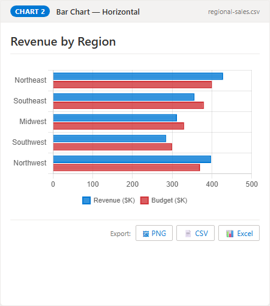

### Line Chart — Revenue vs Target

1. Data source: **Upload File** → select `sample-data/monthly-sales.csv`
2. Chart type: **Line Chart**
3. X Axis: `Month`  |  Y Axis: check `Revenue` and `Target`

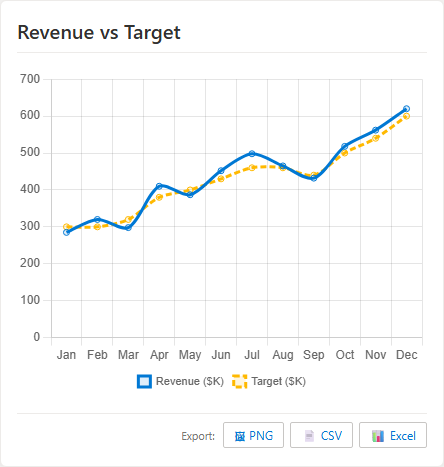

### Area Chart — Revenue & Profit Trend

1. Data source: **Upload File** → select `sample-data/monthly-sales.csv`
2. Chart type: **Area Chart**
3. X Axis: `Month`  |  Y Axis: check `Revenue` and `Profit`

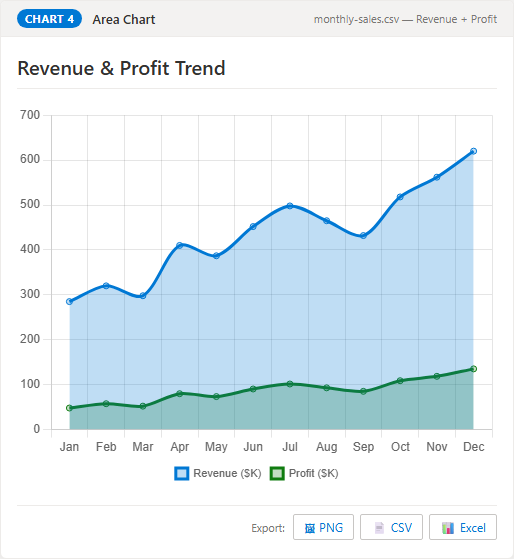

### Scatter Plot — R&D Spend vs Revenue

1. Data source: **Upload File** → select `sample-data/scatter-rnd.csv`
2. Chart type: **Scatter Plot**
3. X Axis: `RnDSpend`  |  Y Axis: `Revenue`

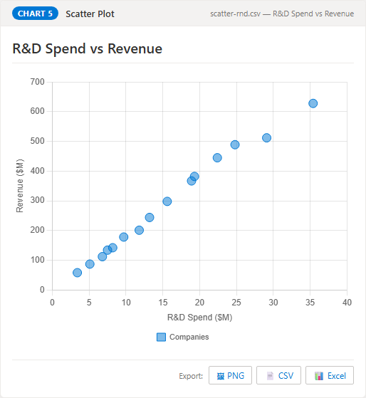

### Bubble Chart — Company Size vs Revenue

1. Data source: **Upload File** → select `sample-data/bubble-companies.csv`
2. Chart type: **Bubble Chart**
3. X Axis: `Revenue`  |  Y Axis: `Employees`  |  Size: `GrowthRate`

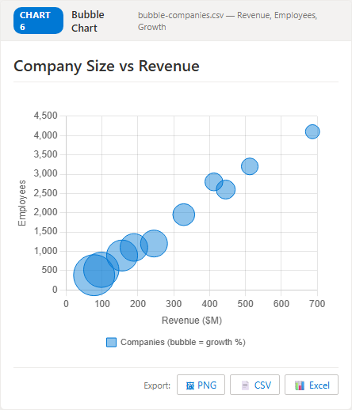

### Pie Chart — Market Share

1. Data source: **Upload File** → select `sample-data/market-share.csv`
2. Chart type: **Pie Chart**
3. Label Column: `Product`  |  Value Column: `MarketShare`

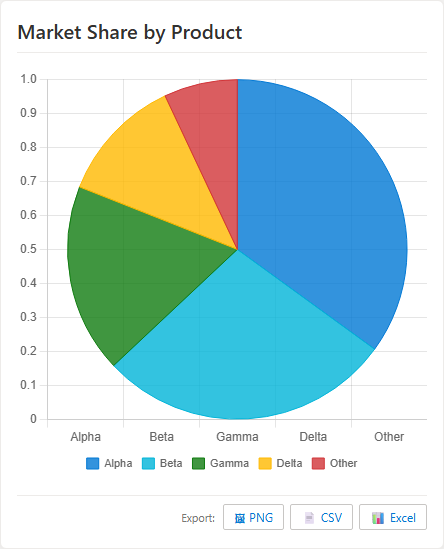

### Doughnut Chart — Market Share

1. Data source: **Upload File** → select `sample-data/market-share.csv`
2. Chart type: **Doughnut Chart**
3. Label Column: `Product`  |  Value Column: `MarketShare`

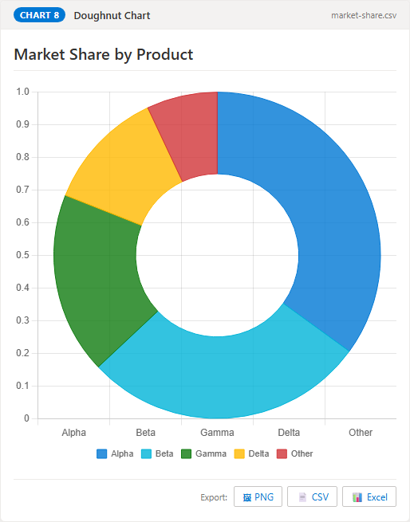

### Radar Chart — Product Comparison

1. Data source: **Upload File** → select `sample-data/radar-products.csv`
2. Chart type: **Radar Chart**
3. X Axis: `Dimension`  |  Y Axis: check `ProductA`, `ProductB`, `ProductC`

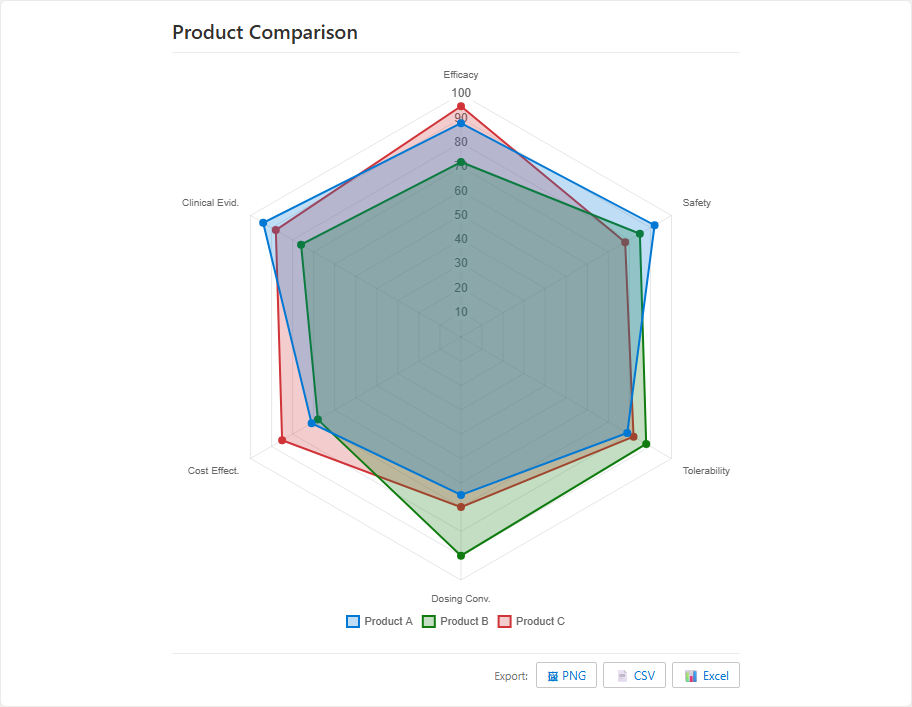

---

## 9. Chart Type Reference

### Stacked mode

Turn on **Stacked** in the property pane when you want to show how individual parts contribute to a total. For example, Revenue + Profit stacked shows both the breakdown and the combined total at the same time.

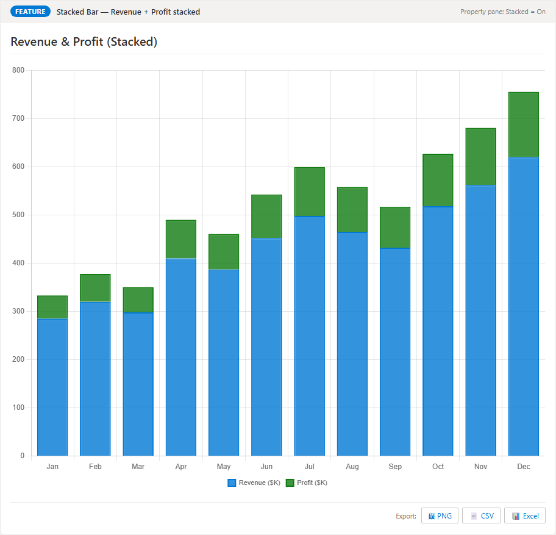

### Data Labels

Enable **Show Data Labels** to annotate each bar, point, or slice with its value. Use **Label Prefix** (e.g., `$`) and **Abbreviate Large Numbers** to format values as `$285K` instead of `285000`.

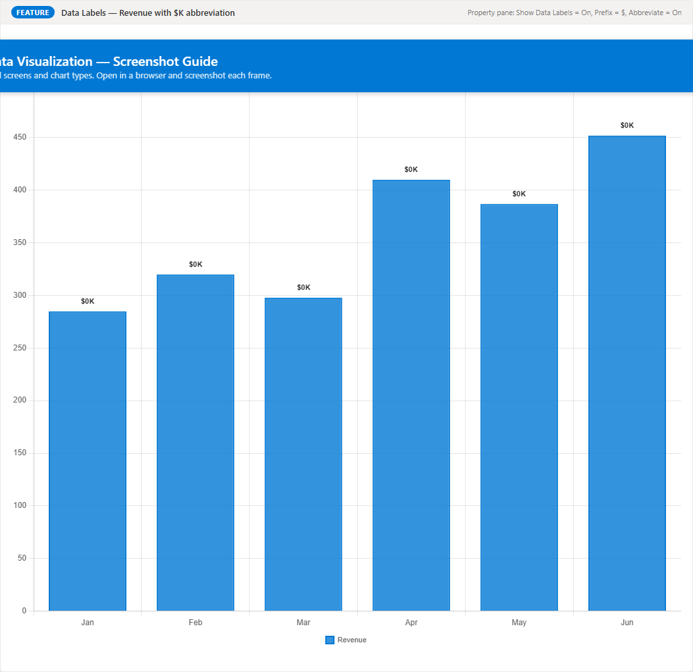

### Color Palettes

Seven built-in palettes are available in the property pane. Choose one that fits your SharePoint theme or use case.

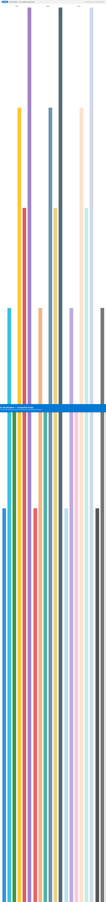

### Multi-series charts

Bar, Line, Area, and Radar charts support multiple Y columns. Each selected column becomes a separate series with its own color from the active palette.

### Pie / Doughnut best practices

- Keep to 7 or fewer slices for readability.
- Use the **Legend** to identify slices when labels don't fit.
- For many categories, use a Bar chart instead.

### Bubble chart sizing

The **Size / Radius column** values are square-rooted internally to keep proportions readable. A company with 1000 employees produces a bubble proportional to √1000 ≈ 31.6, not 1000 pixels wide.

---

## 10. Troubleshooting

### "No data loaded yet"

The chart area shows this message when no data has been loaded. Select a source type, upload or configure your data, and confirm you see a green success message.

### "Failed to parse file" on upload

- Ensure the file is a valid `.csv`, `.tsv`, `.xlsx`, or `.xls` file.
- For CSV files, confirm the first row is a header row with column names.
- For Excel files, data must be on the first sheet.

### Uploaded data is gone after page refresh

If the file exceeded the 200 KB persistence limit, a yellow warning was shown on upload. The data displays for the current session only. Either upload a smaller/filtered file, or store the file in a SharePoint document library and use the **SharePoint File** source.

### SharePoint list error: "Failed to load SharePoint list"

- Double-check the list name (it is case-sensitive and must match the display name exactly).
- Ensure you have at least Read permission on the list.
- If loading from another site, verify the Site URL is correct and accessible.

### REST API: "HTTP 401" or "HTTP 403"

The API requires authentication. SPFx passes the user's SharePoint credentials automatically for same-tenant URLs, but external APIs may require API keys or OAuth tokens not supported by this web part.

### REST API: CORS error

The API server must include `Access-Control-Allow-Origin: *` (or your SharePoint domain) in its response headers.

### Chart appears but shows no data / flat lines

Check that the selected Y Axis column(s) contain numeric values. Text values plot as 0. For Scatter/Bubble charts, both X and Y columns must be numeric.

### Data is loaded but the chart says "select column mappings"

Scroll down to the **Column Mapping** panel and select an X Axis column and at least one Y Axis column (or Label + Value columns for Pie/Doughnut charts).
